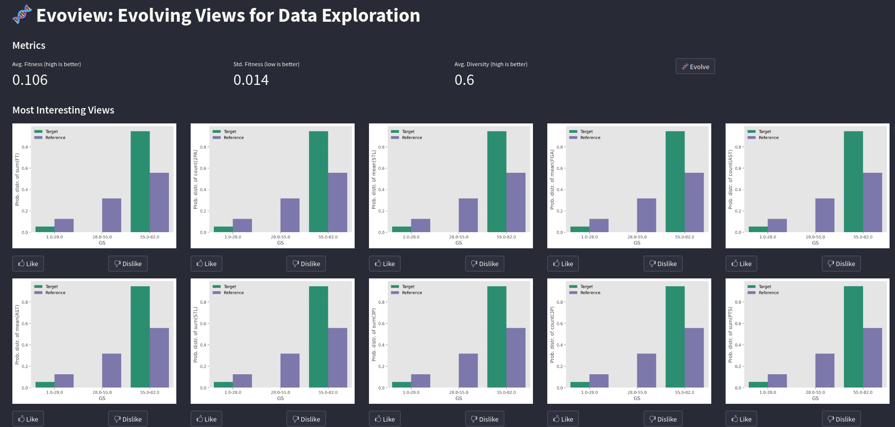

# EvoView: Evolving Views for Data Exploration



Under the increasingly complex and interconnected world we live in, data has become extremely valuable. Nevertheless, exploring even a simple database is not a trivial task, inasmuch as it requires technical knowledge which many new and non-technical data users do not have. We introduce EvoView as a novel view recommendation method that leverages a human-in-the-loop approach to create and evaluate views that tailored to match user intent.

# General Structure

- ```src/app.py```: Streamlit app built for demonstration purposes. Use `streamlit run src/app.py` to run the demo application.
- ```src/evoviewpandas.py```: Implementation of EvoView using Pandas as a database backend.
- ```src/experiment.py```: Code for reproducing experiments.